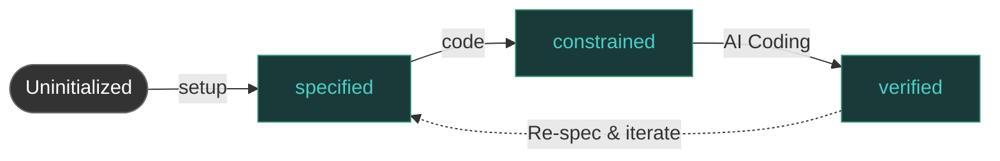

# Workflow

SpecLore's workflow is a unidirectional pipeline from requirements to acceptance, with clear states and entry conditions at each stage.

---

## State Machine



| State | Meaning | Trigger |
|-------|---------|---------|
| `specified` | .feature acceptance criteria generated | `speclore spec` |
| `constrained` | AI coding constraints + test scaffolding generated | `speclore code` |
| `coding` | AI is coding (filling test scaffolding) | Manual coding |
| `verified` | All acceptance tests passed | `speclore verify` |

## MCP Tool Flow

4 MCP tools used in workflow order, each returning current state and recommended next step:

```
speclore.status → speclore.spec → speclore.code → (AI coding) → speclore.verify
   Check status    Generate feature  Generate constraints    Code      Acceptance test
```

### Status Check

```bash
speclore status
```

Displays project diagnostics: configuration status, feature file distribution, workflow progress, recommended actions.

### Requirements → Specs

```bash
speclore spec "Requirement description"    # Plain text
speclore spec requirements.md             # Markdown file
speclore spec design.docx                 # Word document
speclore spec mockup.png                  # Image (OCR)
```

### Specs → Constraints

```bash
speclore code                            # Process all features
speclore code specs/auth/                # Process specific directory
```

### Acceptance Testing

```bash
speclore verify                          # Run all verifications
speclore verify --impact                 # With change impact analysis
speclore verify --watch                  # Watch mode
speclore verify --watch --timeout 60     # Watch for 60 minutes
```

## Strong Workflow Constraints

Out-of-order calls return clear errors with correct guidance:

| Out-of-order Scenario | Error Message |
|----------------------|---------------|
| Call `code` without .feature files | `No .feature files found. Run speclore.spec first.` |
| Call `verify` without test scaffolding | `No test scaffolding. Run speclore.code first.` |
| Project not initialized | Automatically creates `.speclore/config.yaml` |
| Invalid state transition (e.g., `specified` → `verified`) | `Invalid state transition` error |

## Auto-Initialization & Migration

Every MCP tool entry point automatically checks and initializes the project:

1. Ensures `.speclore/config.yaml` exists (generates default config if not)
2. Ensures `.speclore/state.yaml` exists (creates if not)
3. Scans `specs/` directory, registers untracked `.feature` files as `specified` state

After upgrading SpecLore, no manual action is needed — migration happens automatically on first tool invocation.

For manual migration:

```bash
speclore migrate
```

::: tip Next Steps
- See [Examples](/en/guide/examples)
- Learn how [Test Mapping](/en/reference/test-mapping) maps test results back to .feature scenarios
:::
